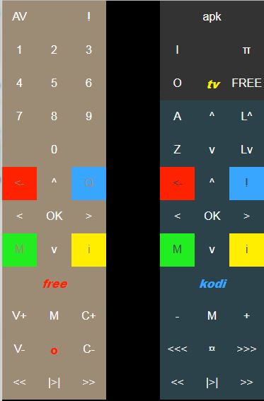

# teleco
Remote control for my Raspberry pi, my TV and my Freebox (french Internet Provider media player)

This is not finalized, and probably won't be finalized ...
But it works for me ...

Requirements on server :

https://github.com/haikuginger/kodipydent

https://github.com/MaximeCheramy/remotefreebox

## Server
The server is a python script running with Flask.

I installed it as a service on my raspberry pi with supervisorctl

The server runs on port 8080.

Default route returns a HTML remote control :

